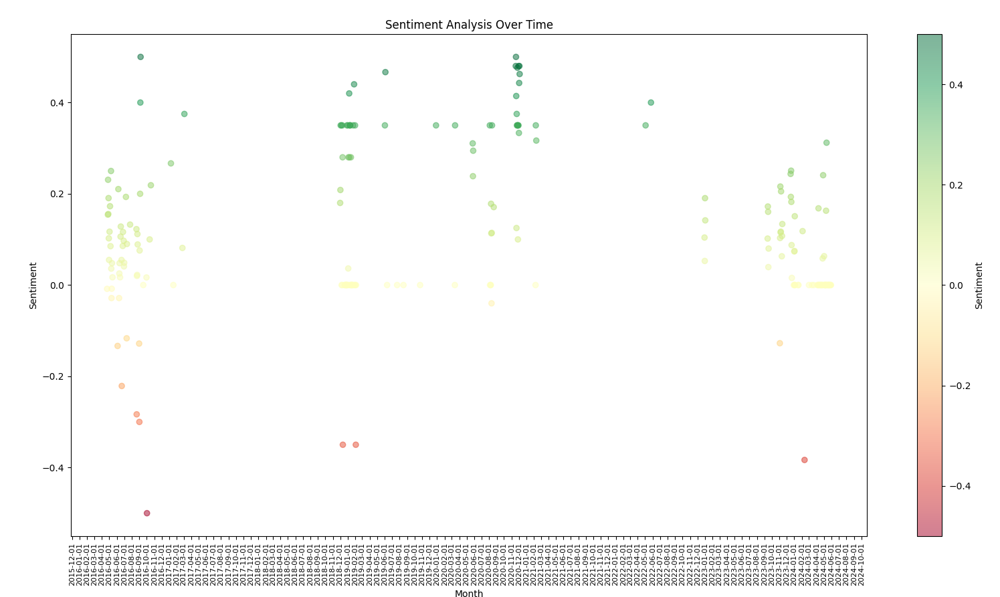

# observing-obsidian

Using python, NLP and text vectors to explore my daily notes over the past 8 years.

Designed to work with notes stored in an obsidian vault.

## Get running

- Activate venv `source env/scripts/activate`
- Install requirements `pip install -r requirements.txt`
- Run the app `py app.py`

## Example output

### Validation of sentiment analysis

#### Very negative

- 2024-02-12 - was making notes about consequences of product failure (death, injury, harm ect)
- 2016-09-30 - reality was talking about a nerf gun battle - was actually a great day

#### Very Positive

- 2016-09-04 - marked as highest sentiment but contained only "Dis the oje, went really well", not sure why marked so high
- 2020-11-21 - likely high sentiment due to old method of note taking (dailyo) that included daily tags that marked what i did that day such as #party, #guitar ect

## Todo

- parameterise folder location
- exclude dailyo style daily tags, they're interfering with analysis
- make the graph prettier
- vectorise the content of each day
- explore other forms of analysis and look into the approach used by TextBlob
